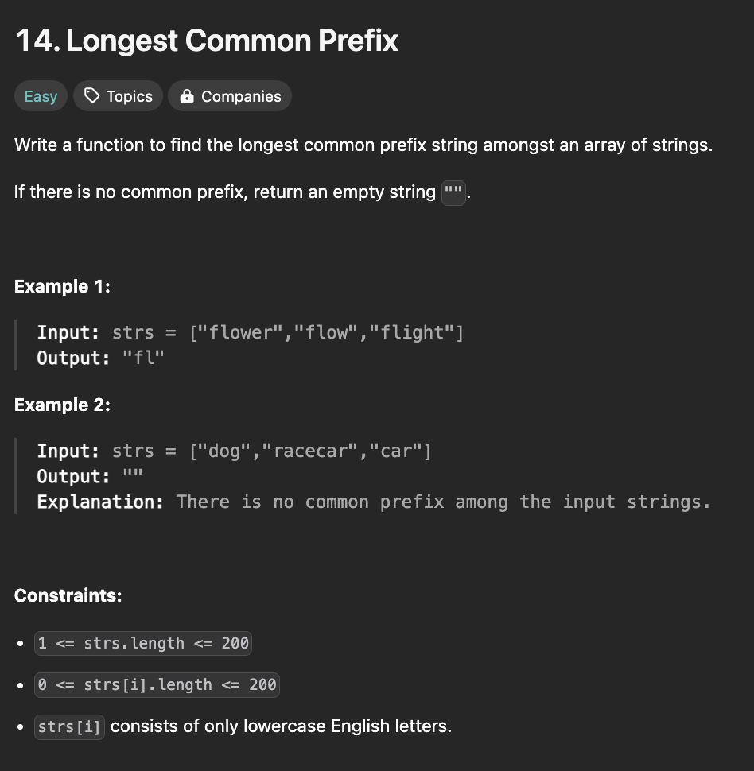

# Longest Common Prefix

## Description

<div align="center" >

</div>

## Solutions

<br />

**Solution-1:**

```javascript
/**
 * Function: longestCommonPrefix
 * @description Finds the longest common prefix among all
 *  the strings in the array
 * @param {array<string>} strs - List of Strings/Words
 * @returns {string} Longest common prefix string found
 * @example
 *  longestCommonPrefix(["flower","flow","flight"]);
 */
function longestCommonPrefix(strs) {
  let F = strs[0];
  let i = 1;
  while (i++ < strs.length)
    while (strs[i - 1].indexOf(F) != 0) F = F.slice(0, F.length - 1);
  return F;
}
```

<div align="center" >

</div>

<br />

**Solution-2:**

```javascript
/**
 * Function: longestCommonPrefix
 * @description Finds the longest common prefix among all
 *  the strings in the array
 * @param {array<string>} strs - List of Strings/Words
 * @returns {string} Longest common prefix string found
 * @example
 *  longestCommonPrefix(["flower","flow","flight"]);
 */
function longestCommonPrefix(strs) {
  let F = strs[0];
  let i = 1;
  while (i++ < strs.length)
    while (strs[i - 1].indexOf(F) != 0)
      F = F.substring(0, F.length - 1);
  return F;
}
```

<div align="center" >

</div>

<br />