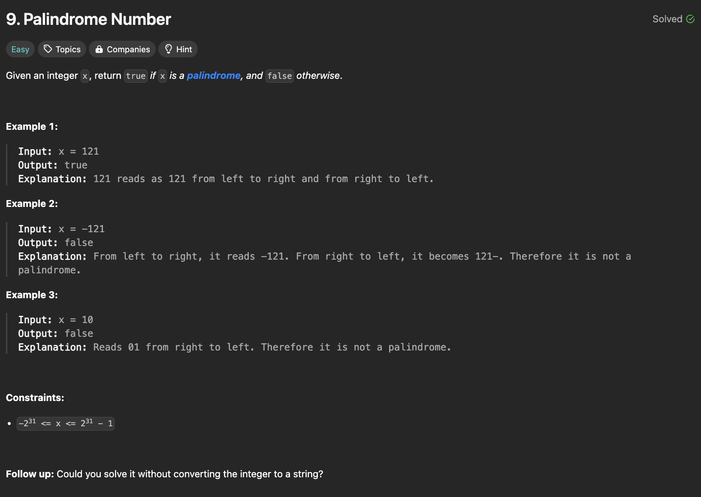

# Palindrome Number

## Description

<div align="center" >

</div>

## Solutions

<br />

**Solution-1:**

```javascript
/**
 * Function: IsPalindrome
 * @description Validates if a Number is Palindrome
 * @param {number} x - Any Number
 * @returns {boolean}
 * @example
 *  isPalindrome(-121); // false
 *  isPalindrome(10); // false
 *  isPalindrome(121); // true
 */
function isPalindrome(x) {
  if (x < 0) return false;
  else if (x < 10) return true;
  else {
    let x2 = x,
      rNum = 0;
    do rNum = rNum * 10 + (x % 10);
    while ((x = Math.floor(x / 10)) != 0);
    return x2 == rNum;
  }
}
```

<div align="center" >

</div>

<br />

**Solution-2:**

```javascript
/**
 * Function: IsPalindrome
 * @description Validates if a Number is Palindrome
 * @param {number} x - Any Number
 * @returns {boolean}
 * @example
 *  isPalindrome(-121); // false
 *  isPalindrome(10); // false
 *  isPalindrome(121); // true
 */
function isPalindrome(x) {
  if (x < 0) return false;
  else if (x < 10) return true;
  else {
    let x2 = x;
    let rNum = 0;
    while (x != 0) {
      rNum = rNum * 10 + (x % 10);
      x = Math.floor(x / 10);
    }
    return x2 == rNum;
  }
}
```

<div align="center" >

</div>

<br />