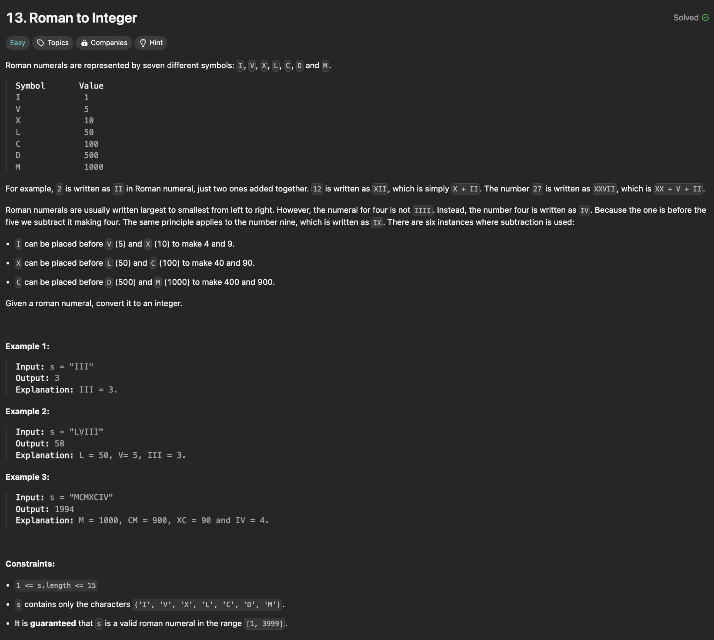

# Two Sum

## Description

<div align="center" >

</div>

## Solutions

<br />

**Solution-1:**

```javascript
function romanToInt(s) {
  const R = { I: 1, V: 5, X: 10, L: 50, C: 100, D: 500, M: 1000 };
  let fNum = 0;
  let i = 0;
  while (i < s.length) {
    fNum +=
      R[s[i]] < R[s[i + 1]] ? R[s[++i]] - R[s[i++ - 1]] : R[s[i++]];
  }
  return +fNum;
}
```

<div align="center" >

</div>

<br />

**Solution-2:**

```javascript
function romanToInt(s) {
  const ROMANS = {
    I: 1,
    IV: 4,
    V: 5,
    IX: 9,
    X: 10,
    XL: 40,
    L: 50,
    XC: 90,
    C: 100,
    CD: 400,
    D: 500,
    CM: 900,
    M: 1000,
  };
  let num = 0;
  let i = 0;
  while (i < s.length) {
    num +=
      ROMANS[s[i] + s[i + 1]] != undefined
        ? ROMANS[s[++i - 1] + s[i++]]
        : ROMANS[s[i++]];
  }
  return num;
}
```

<div align="center" >

</div>

<br />