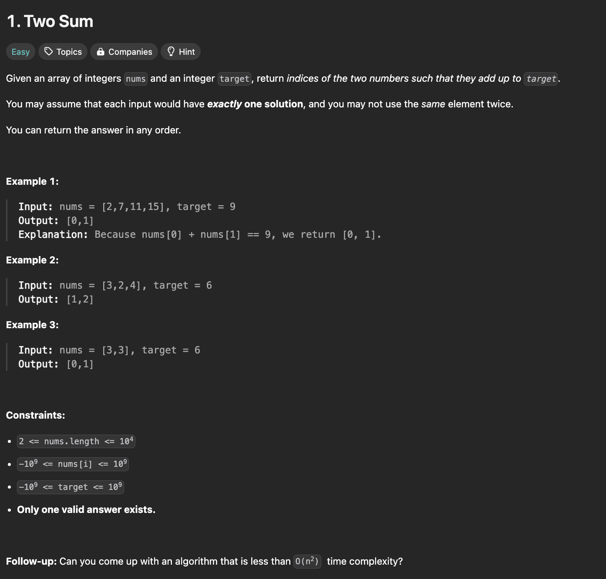
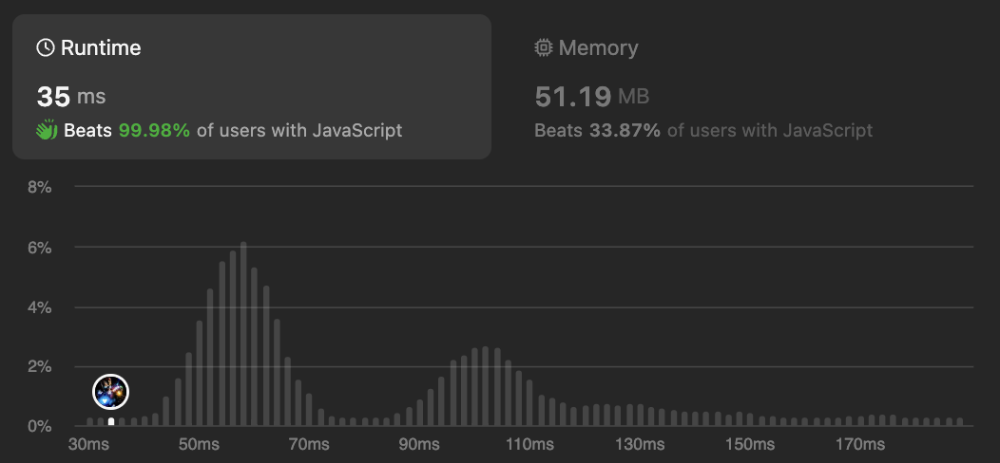
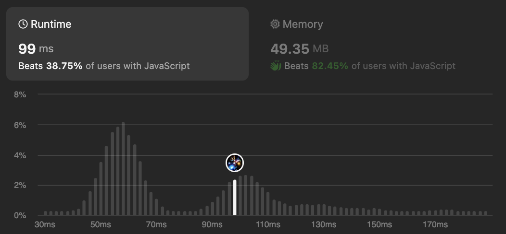

# Two Sum

## Description

<div align="center" >

</div>

## Explanation

## Solutions

<br />

**Solution-1:**

```javascript
function twoSum(nums, target) {
  let myMap = [];
  let i = 0;
  while (i < nums.length) {
    if (myMap[nums[i]] != undefined) return [i, myMap[nums[i]]];
    myMap[target - nums[i]] = i++;
  }
  return null;
}
```

<div align="center" >

</div>

<br />

**Solution-2:**

```javascript
function twoSum(nums, target) {
  for (let i = 0; i < nums.length; i++) {
    for (let j = i + 1; j < nums.length; j++) {
      if (nums[i] + nums[j] == target) return [i, j];
    }
  }
}
```

<div align="center" >

</div>

<br />