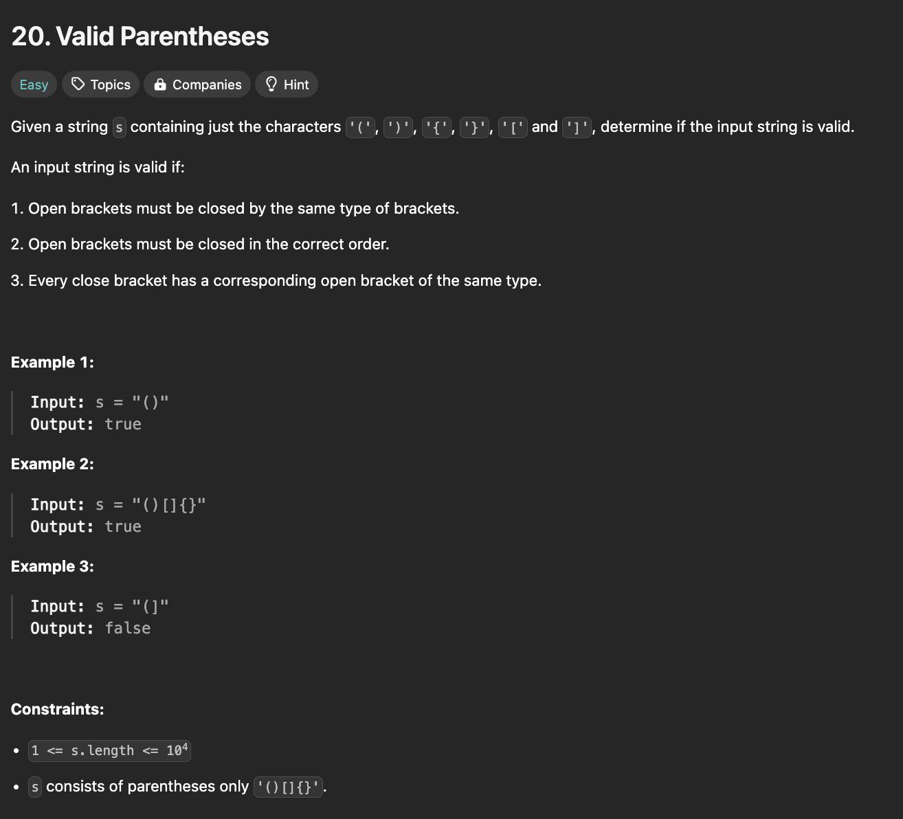

# Valid Parenthesis

## Description

<div align="center" >

</div>

## Solutions

<br />

**Solution-1:**

```javascript
/**
 * Function: IsPalindrome
 * @description Validates if a Number is Palindrome
 * @param {number} x - Any Number
 * @returns {boolean}
 * @example
 *  isPalindrome(-121); // false
 *  isPalindrome(10); // false
 *  isPalindrome(121); // true
 */
function isValid(s) {
  if (s.length % 2 != 0) return false;
  let X = [];
  for (let i = 0; i < s.length; i++) {
    if (s[i] == "(" || s[i] == "{" || s[i] == "[") X.push(s[i]);
    else if (
      X.length != 0 &&
      ((s[i] == ")" && X[X.length - 1] == "(") ||
        (s[i] == "}" && X[X.length - 1] == "{") ||
        (s[i] == "]" && X[X.length - 1] == "["))
    )
      X.pop();
    else return false;
  }
  return X.length == 0;
}
```

<div align="center" >

</div>

<br />